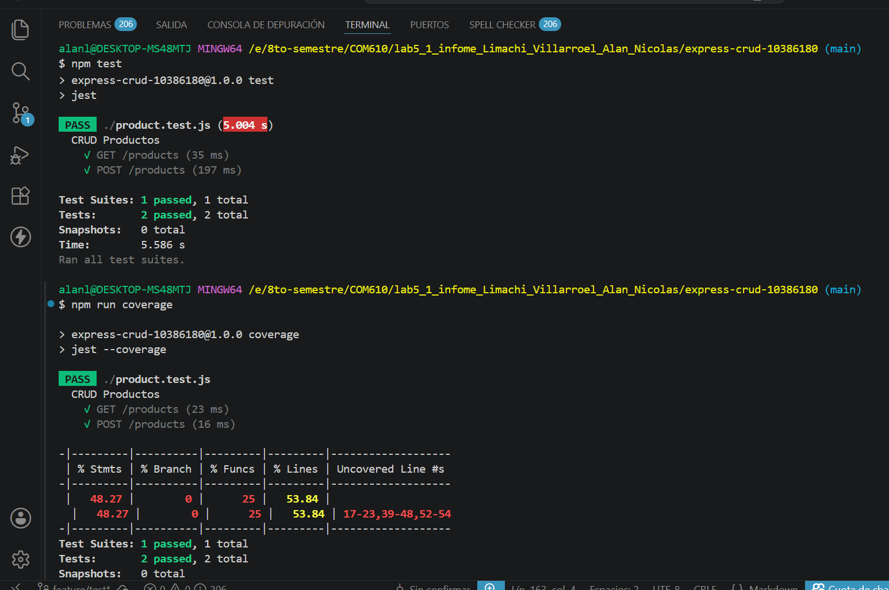
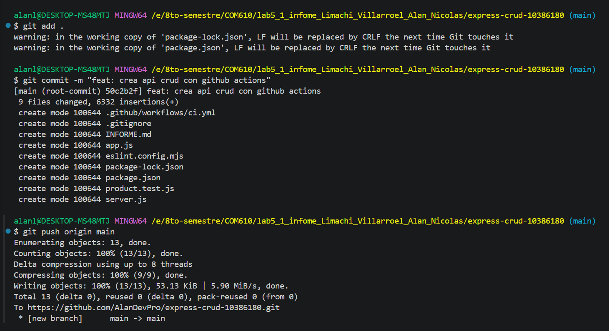
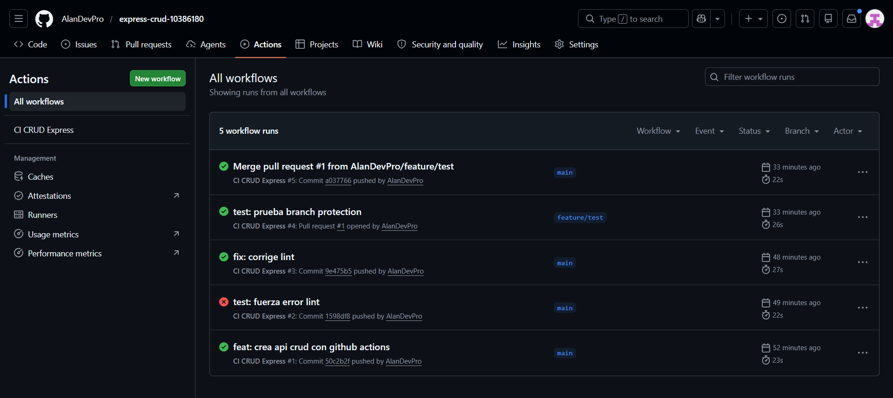
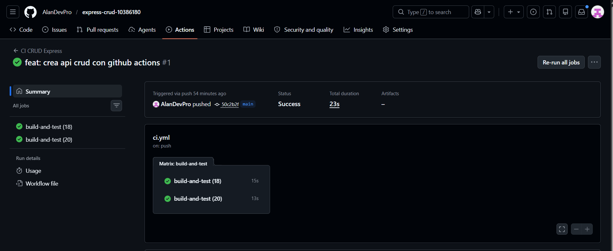
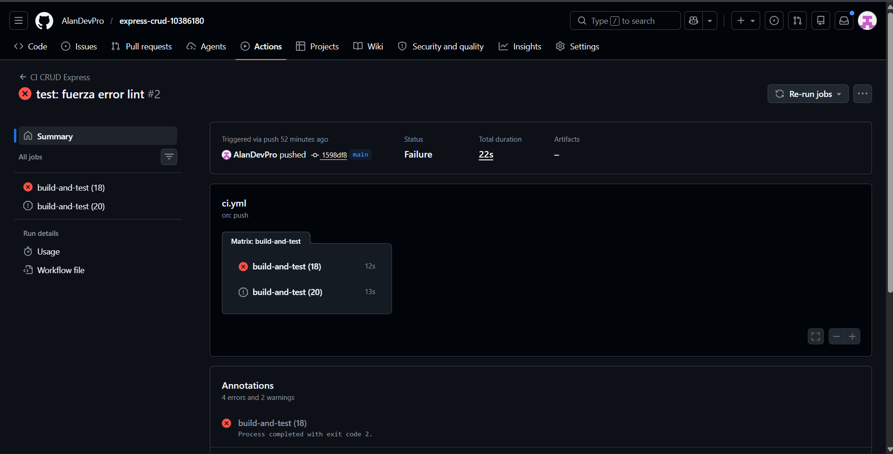
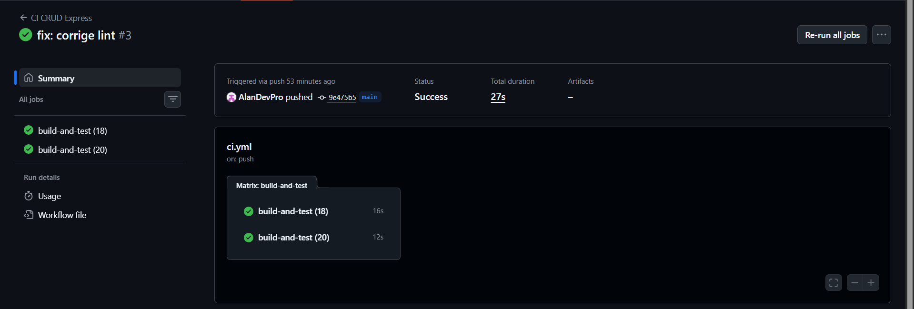
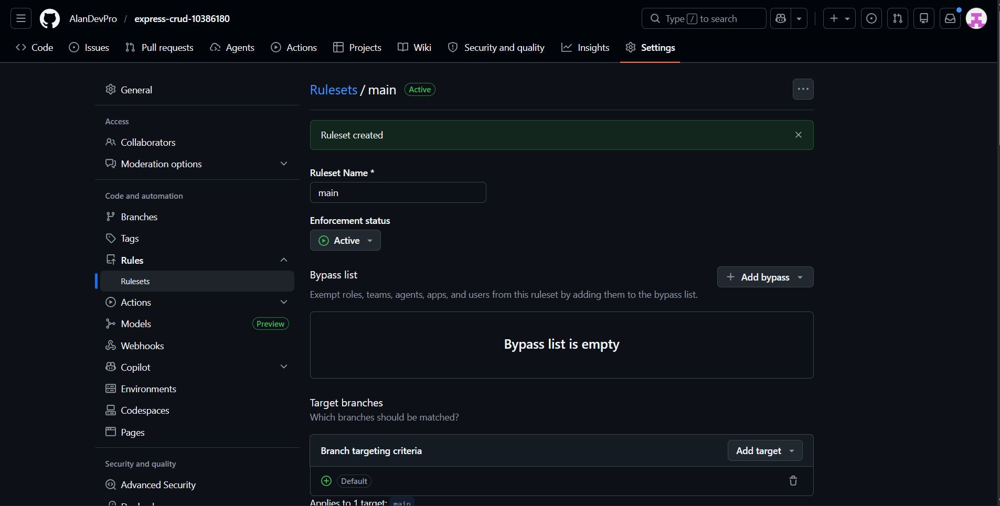
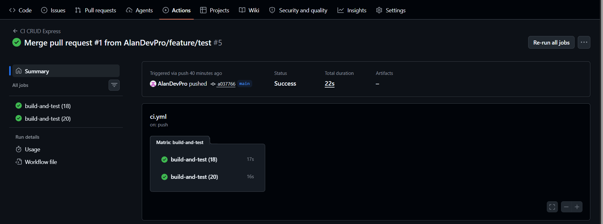

# INFORME.md — Práctica Individual: CI con Express CRUD

**Asignatura:** DevOps & Integración Continua  
**Práctica:** Individual — Express CRUD con GitHub Actions CI  
**Repositorio:** [https://github.com/AlanDevPro/express-crud-10386180](https://github.com/AlanDevPro/express-crud-10386180)  
**Fecha de entrega:** Mayo 2026

---

## Tabla de Contenidos

1. [Resumen Ejecutivo](#1-resumen-ejecutivo)
2. [Parte 1 — Creación del proyecto y pruebas locales](#2-parte-1--creación-del-proyecto-y-pruebas-locales)
3. [Parte 2 — Configuración del workflow de CI](#3-parte-2--configuración-del-workflow-de-ci)
4. [Parte 3 — Forzar error y corregir pipeline](#4-parte-3--forzar-error-y-corregir-pipeline)
5. [Parte 4 — Protección de rama y Pull Request](#5-parte-4--protección-de-rama-y-pull-request)
6. [Conclusiones](#6-conclusiones)

---

## 1. Resumen Ejecutivo

Esta práctica tuvo como objetivo implementar un pipeline de **Integración Continua (CI)** usando **GitHub Actions** sobre una API REST construida con **Node.js y Express**. Se configuró: la base del proyecto con operaciones CRUD y pruebas de integración, un workflow de CI automatizado con linting y cobertura, una matriz de versiones de Node.js en paralelo, protección de rama sobre `main` y un Pull Request desde una rama de feature.

---

## 2. Parte 1 — Creación del proyecto y pruebas locales

### Objetivo
Crear la base del proyecto: un repositorio en GitHub con una API REST Express que implemente operaciones CRUD sobre la entidad `Producto` y pruebas de integración funcionales.

### Pasos realizados

#### 2.1 Creación y clonación del repositorio

Se creó un repositorio público en GitHub llamado `express-crud-10386180` y se clonó localmente:

```bash
git clone https://github.com/AlanDevPro/express-crud-10386180.git
cd express-crud-10386180
```

#### 2.2 Inicialización del proyecto e instalación de dependencias

```bash
npm init -y
npm install express
npm install --save-dev jest supertest
npm install --save-dev eslint @eslint/js globals
```

Esto generó el archivo `package.json` y descargó las dependencias necesarias: `express` como framework web, `jest` como framework de pruebas, `supertest` para pruebas de integración HTTP y `eslint` para análisis estático del código.

#### 2.3 Creación del archivo `app.js`

Se creó la aplicación Express con los cinco endpoints CRUD sobre la entidad `Producto`:

```javascript
const express = require('express');
const app = express();
app.use(express.json());

let products = [
  { id: 1, name: 'Laptop', price: 1000 },
  { id: 2, name: 'Mouse', price: 50 }
];

app.get('/products', (req, res) => res.json(products));

app.get('/products/:id', (req, res) => {
  const product = products.find(p => p.id === parseInt(req.params.id));
  if (!product) return res.status(404).json({ message: 'Producto no encontrado' });
  res.json(product);
});

app.post('/products', (req, res) => {
  const newProduct = { id: products.length + 1, name: req.body.name, price: req.body.price };
  products.push(newProduct);
  res.status(201).json(newProduct);
});

app.put('/products/:id', (req, res) => {
  const product = products.find(p => p.id === parseInt(req.params.id));
  if (!product) return res.status(404).json({ message: 'Producto no encontrado' });
  product.name = req.body.name;
  product.price = req.body.price;
  res.json(product);
});

app.delete('/products/:id', (req, res) => {
  products = products.filter(p => p.id !== parseInt(req.params.id));
  res.json({ message: 'Producto eliminado' });
});

module.exports = app;
```

**Endpoints implementados:**

| Método | Ruta            | Descripción                |
|--------|-----------------|----------------------------|
| GET    | `/products`     | Lista todos los productos  |
| GET    | `/products/:id` | Obtiene un producto por ID |
| POST   | `/products`     | Crea un nuevo producto     |
| PUT    | `/products/:id` | Actualiza un producto      |
| DELETE | `/products/:id` | Elimina un producto        |

#### 2.4 Creación del archivo `server.js`

Archivo encargado de levantar el servidor, separado de la lógica de la aplicación para facilitar las pruebas:

```javascript
const app = require('./app');
const PORT = process.env.PORT || 3000;

app.listen(PORT, () => {
  console.log(`Servidor ejecutándose en puerto ${PORT}`);
});
```

#### 2.5 Creación de las pruebas en `product.test.js`

Se escribieron pruebas de integración con `supertest` que cubren las funcionalidades principales:

```javascript
const request = require('supertest');
const app = require('./app');

describe('CRUD Productos', () => {
  test('GET /products', async () => {
    const res = await request(app).get('/products');
    expect(res.statusCode).toBe(200);
    expect(Array.isArray(res.body)).toBe(true);
  });

  test('POST /products', async () => {
    const res = await request(app)
      .post('/products')
      .send({ name: 'Teclado', price: 100 });
    expect(res.statusCode).toBe(201);
    expect(res.body.name).toBe('Teclado');
  });
});
```

#### 2.6 Configuración de scripts en `package.json`

```json
"scripts": {
  "start": "node server.js",
  "test": "jest",
  "lint": "eslint .",
  "coverage": "jest --coverage"
}
```

#### 2.7 Ejecución local de lint, pruebas y cobertura

```bash
npm run lint
npm test
npm run coverage
```



**Resultado esperado:** Las 2 pruebas pasan correctamente y se genera el reporte de cobertura en la carpeta `coverage/`.

#### 2.8 Primer commit al repositorio

```bash
git add .
git commit -m "feat: crea api crud con github actions"
git push origin main
```

### Resultado
El repositorio quedó inicializado con una API funcional, pruebas verificadas localmente y el código subido a GitHub.

---

## 3. Parte 2 — Configuración del workflow de CI

### Objetivo
Automatizar la ejecución de lint, pruebas y cobertura ante eventos de `push` y `pull_request` sobre la rama `main`, con una matriz que valide en Node.js 18 y 20 simultáneamente.

### Pasos realizados

#### 3.1 Creación de la carpeta del workflow

```bash
mkdir -p .github/workflows
```

#### 3.2 Definición del archivo `ci.yml`

```yaml
name: CI CRUD Express

on:
  push:
    branches: [main]
  pull_request:
    branches: [main]

jobs:
  build-and-test:
    runs-on: ubuntu-latest

    strategy:
      matrix:
        node-version: [18, 20]

    steps:
      - name: Checkout del codigo
        uses: actions/checkout@v4

      - name: Configurar Node.js ${{ matrix.node-version }}
        uses: actions/setup-node@v4
        with:
          node-version: ${{ matrix.node-version }}

      - name: Instalar dependencias
        run: npm ci

      - name: Ejecutar lint
        run: npm run lint

      - name: Ejecutar tests
        run: npm test

      - name: Generar coverage
        run: npm run coverage
```

**Descripción de cada componente:**

| Componente | Descripción |
|---|---|
| `on: push / pull_request` | El workflow se dispara automáticamente al hacer push o abrir un PR sobre `main` |
| `runs-on: ubuntu-latest` | El job se ejecuta en una máquina virtual Ubuntu provista por GitHub |
| `strategy.matrix` | Genera un job independiente por cada versión de Node.js definida |
| `actions/checkout@v4` | Descarga el código del repositorio en el runner |
| `actions/setup-node@v4` | Instala la versión de Node.js indicada en la matriz |
| `npm ci` | Instala dependencias de forma reproducible desde `package-lock.json` |
| `npm run lint` | Analiza el código con ESLint antes de ejecutar pruebas |
| `npm test` | Ejecuta las pruebas de integración con Jest y Supertest |
| `npm run coverage` | Genera el reporte de cobertura de código |

> **Nota:** `npm ci` difiere de `npm install` en que no modifica `package-lock.json` y falla si hay discrepancias, siendo ideal para entornos de CI.

#### 3.3 Commit y push del workflow


#### 3.4 Verificación en GitHub Actions

Se navegó a la pestaña **Actions** del repositorio, donde se confirmó que:
- El workflow `CI CRUD Express` se ejecutó automáticamente tras el push.
- Se generaron **dos jobs en paralelo**: `build-and-test (18)` y `build-and-test (20)`.
- Cada job completó todos los pasos sin errores.





### Resultado
El pipeline de CI quedó operativo. Cualquier `push` o `pull_request` sobre `main` dispara automáticamente la validación completa del código en dos versiones de Node.js en paralelo.

---

## 4. Parte 3 — Forzar error y corregir pipeline

### Objetivo
Validar que el pipeline detecta errores reales de linting y bloquea la integración, luego corregirlo y confirmar que vuelve a pasar.

### Pasos realizados

#### 4.1 Introducción intencional de un error de lint

Se agregó una variable sin uso en `app.js` para provocar un fallo de ESLint:

```javascript
const unusedVariable = 'error';
```

```bash
git add .
git commit -m "test: fuerza error lint"
git push origin main
```

#### 4.2 Verificación del fallo en GitHub Actions

En la pestaña **Actions** se observó que el workflow falló (❌) en el paso **Ejecutar lint**, deteniendo el pipeline antes de llegar a las pruebas. Esto confirma que el linting actúa como una primera barrera de calidad efectiva.



**Orden de los pasos y su justificación:**
El linting se ejecuta primero porque es la verificación más rápida. Si el código no cumple las reglas de estilo, no tiene sentido gastar tiempo ejecutando las pruebas.

#### 4.3 Corrección y restauración del pipeline

Se eliminó la variable no utilizada, se realizó un nuevo commit y push:

```bash
git add .
git commit -m "fix: corrige lint"
git push origin main
```

El pipeline volvió a pasar correctamente (✅).



### Resultado
Se demostró el principio **fail fast** de CI: el pipeline detecta y bloquea errores lo antes posible, optimizando el tiempo de retroalimentación para el desarrollador.

---

## 5. Parte 4 — Protección de rama y Pull Request

### Objetivo
Configurar una regla de protección sobre `main` que impida merges sin que el CI pase, y verificar el flujo completo con un Pull Request desde una rama de feature.

### Pasos realizados

#### 5.1 Configuración de la regla de protección de rama

En GitHub se navegó a `Settings → Branches → Add rule` y se configuró:

- **Branch name pattern:** `main`
- ✅ **Require status checks to pass before merging**
- Check obligatorio seleccionado: `CI CRUD Express`



#### 5.2 Creación de la rama de feature y cambio

```bash
git checkout -b feature/add-product
```

Se editó `app.js` agregando un producto adicional a los datos iniciales:

```javascript
{ id: 3, name: 'Monitor', price: 300 }
```

#### 5.3 Push y apertura del Pull Request

```bash
git add .
git commit -m "feat: agrega monitor"
git push origin feature/add-product
```

Desde GitHub se creó el Pull Request hacia `main` con el botón **Compare & Pull Request**.

#### 5.4 Verificación del flujo CI en el PR

Se confirmó que:
- El workflow `CI CRUD Express` se ejecutó automáticamente al abrir el PR.
- GitHub bloqueó el merge mientras el check estaba pendiente o fallido.
- Una vez que todos los checks pasaron (✅), el merge quedó habilitado.



### Resultado
La protección de rama garantizó que ningún código sin verificar pudiera integrarse a `main`. El flujo completo de feature branch → CI automático → merge protegido quedó operativo.

---

## 6. Conclusiones

- **Automatización del ciclo de verificación:** Cada `push` o `pull_request` dispara automáticamente el pipeline, eliminando la dependencia de verificaciones manuales y reduciendo el riesgo de introducir errores en la rama principal.

- **La calidad del código como requisito, no como opción:** La integración de ESLint antes de las pruebas establece un estándar obligatorio de estilo y buenas prácticas. Si el código no pasa el linting, las pruebas ni se ejecutan, ahorrando tiempo y reforzando la disciplina de escritura de código limpio.

- **Matrices de ejecución para compatibilidad multi-entorno:** La `strategy.matrix` permite validar el código en Node.js 18 y 20 en paralelo sin duplicar la definición del workflow, garantizando que el proyecto funciona en distintos entornos de forma eficiente.

- **Protección de ramas como barrera de seguridad:** La regla configurada sobre `main` impide que código sin verificar llegue a producción, siendo especialmente valiosa en equipos donde múltiples desarrolladores contribuyen al mismo repositorio.

- **Fail fast como principio de CI:** Ordenar los pasos de menor a mayor costo computacional (linting → pruebas → coverage) permite detectar errores lo antes posible, optimizando el tiempo de retroalimentación para el desarrollador.

En conjunto, esta práctica establece las bases de una cultura de integración continua sólida, donde la calidad y la compatibilidad del código se verifican de forma automática, consistente y transparente en cada cambio introducido al repositorio.

---


enlace repositorio: https://github.com/AlanDevPro/express-crud-10386180 